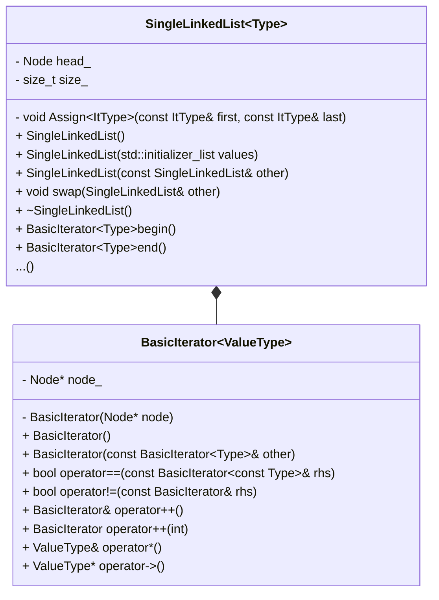

# Single-linked-list

Реализации собственного односвязного списка.

## Структура проекта


<br>

### Основные структурные элементы

Основным элементов является шаблон класса односвязного списка. В нем реализованы методы для работы со списком, а так же содержится определение шаблона класса соответствующего итератора.

### Используемые иснтрументы

- компилятор: gcc 11.4.0
- стандарт языка: С++17
- отладчик: GNU gdb 12.1

## Download

Скачать репозиторий можно с помощью команды:

```
git clone git@github.com:alexkozlovvv/cpp-single-linked-list.git
```

## Usage

На данном этапе проект не предполагает интерактивного взаимодействия с пользователем поскольку отсутствует обработка входных команд. При запуске встроенный тест создает односвязный список, проверяет правильность работы методов и взаимодействия со списком с помощью итераторов. 


